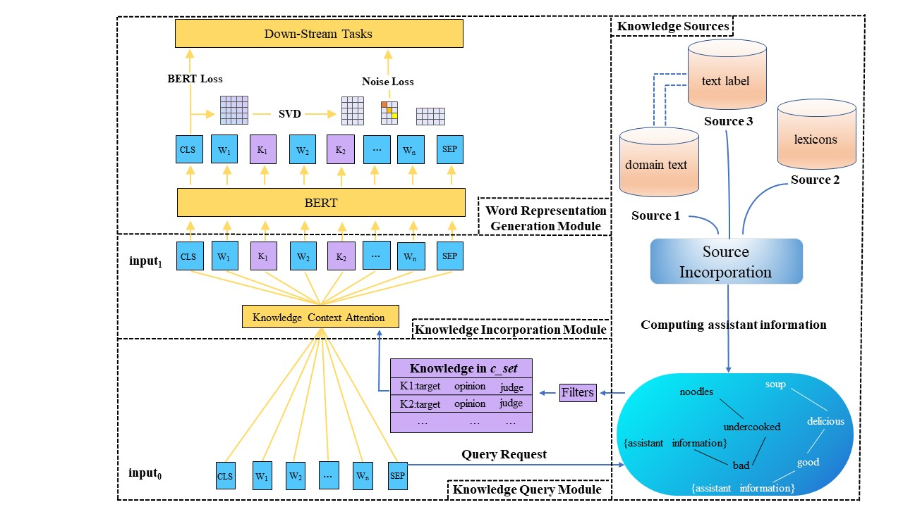

# ASKG
code for ASKG: Learning Sentiment-EnhancedWord Representation with External Knowledge Obtained by Weak Supervision

## Model Architecture
<p align="center">
    
</p> 

## Requirements
### Environment
```
* Python == 3.6.9
* Pytorch == 1.9.0
* CUDA == 10.2.89
* NVIDIA Tesla V100
* HuggingFaces Pytorch (also known as pytorch-pretrained-bert & transformers)
* Stanford CoreNLP (stanford-corenlp-full-2018-10-05)
* Numpy, Pickle, Tqdm, Scipy, etc. (See requirements.txt)
```

### Datasets
Datasets include:
```
* SST-5 (highly negative,negative,neutral,positive,highly positive)
* SST-3 (negative,neutral,positive)
* MR (positive)
* ALM (angry-disgusted, fearful, happy, sad, surprised.)
* AMAN (happy, sad, disgust, angry, fear, surprise.) 
```
*All datasets are available on request to the owner of dataset.* 

[SST dataset,including SST3 and SST5](https://nlp.stanford.edu/sentiment/)

[MR dataset](https://www.cs.cornell.edu/people/pabo/movie-review-data/)

[ALM dataset](http://people.rc.rit.edu/~coagla/affectdata/index.html)

[AMAN dataset](http://saimacs.github.io/)

### File Architecture (Selected important files)
```
-- /autosenti/generate_kgs_xxxx.py                                  ---> generate kgs wihtout external knowledge
-- /autosenti/add_externsenti2kgs.py                                ---> add external knowledge to kgs (i.e. sentiwordnet 3.0.0)
-- /autosenti/knowledgegraph.py                                     ---> knowledge filters and knowledge incorporation
-- /lexicon/senti_score.txt                                         ---> the converted results of sentiwordnet 3.0.0
-- /autosenti/kgs/xxx.spo                                           ---> automatically generated knwoledge
-- /datasets                                                        ---> datasets
-- /models                                                          ---> config files of pre-trained models
-- /skgframework                                                    ---> the framework of ASKG
```

## Get Started
* Download the ``bert-base.bin`` from [here](https://share.weiyun.com/EY7aJitJ) or [here](https://drive.google.com/file/d/1Uq-fuDo8qPv2FywCnbxW83ymIo4Xo3BJ/view?usp=sharing), and save it to the ``models/`` directory.
* Download the ``bert-PT.bin`` from [here](https://share.weiyun.com/2fUr7Mgu) or [here](https://drive.google.com/file/d/1tXjpMLLR4wdYT7qe4IT6U9Wh5fis09hY/view?usp=sharing), and save it to the ``models/`` directory.
* Download the ``GoogleNews-vectors-negative300.bin.gz`` from [here](https://drive.google.com/file/d/0B7XkCwpI5KDYNlNUTTlSS21pQmM/edit?resourcekey=0-wjGZdNAUop6WykTtMip30g), and unzip it to the ``autosenti/models/`` directory.
* Download the ``stanford-corenlp-full-2018-10-05.zip`` from [here](http://nlp.stanford.edu/software/stanford-corenlp-full-2018-10-05.zip), and unzip it to the ``autosenti/`` directory.

#### Generate Sentiment Knowledge
* a) You can directly download the sentiment knowledge from [here](https://share.weiyun.com/GVupcuPO) or [here](https://drive.google.com/drive/folders/1YF1l-9ccUgTIT0j5Psmk6x7G7bSMIxok?usp=sharingand) save it to ``autosenti/`` or ``autosenti/kg`` directory.
* b) Or you can also generate it on your own by utilizing our scripts
```
The process of generating sentiment knowlegde on your own
(1).Generate sentiment knowledge without external knowledge
run generate_kgs_xxx.py
(2).Add external knowledge to sentiment knowledge 
(Notice for emotion classification ALM and AMAN datasets, do not add external sentiment knowledge)
python add_externsenti2kgs.py \
      --input_spo_path ./kgs/xx.spo \
      --output_spo_path ./kgs/xx 
(3).Add your generated spo file to ``autosenti/config.py``
```

## Sentiment Classification and Emotion Detection
### Classification example

Run example on sst5 with SKG-BERT:
```sh
CUDA_VISIBLE_DEVICES=0 nohup python3 -u run_classifier.py \
    --pretrained_model_path ./models/bert-base.bin \
    --vocab_path  ./models/google_uncased_en_vocab.txt \
    --train_path  ./datasets/sst5/train.tsv \
    --dev_path  ./datasets/sst5/dev.tsv \
    --test_path  ./datasets/sst5/test.tsv \
    --output_model_path  ./models/sst5/modelsst5-bertbase.bin \
    --config_path ./models/bert/base_config.json \
    --epochs_num 5 \
    --batch_size 32 \
    --embedding word_pos_seg \
    --encoder transformer \
    --mask fully_visible \
    --kg_name sst5_addsenti \
    --workers_num 1 \
    --em_weight 0.6 \
    --mylambda 0.6 \
    --k0 0 \
    --k 2 \
    --l_ra0 1 \
    --l_ra 11 \
    --step 0.01 \
    --report_steps 20 \
```

Run example on sst5 with SKG-BERT-PT:
```sh
CUDA_VISIBLE_DEVICES=0 nohup python3 -u run_classifier.py \
    --pretrained_model_path ./models/bert-PT.bin \
    --vocab_path  ./models/google_uncased_en_vocab.txt \
    --train_path  ./datasets/sst5/train.tsv \
    --dev_path  ./datasets/sst5/dev.tsv \
    --test_path  ./datasets/sst5/test.tsv \
    --output_model_path  ./models/sst5/modelsst5-bertPT.bin \
    --config_path ./models/bert/base_config.json \
    --epochs_num 5 \
    --batch_size 32 \
    --embedding word_pos_seg \
    --encoder transformer \
    --mask fully_visible \
    --kg_name sst5_addsenti \
    --workers_num 1 \
    --em_weight 0.6 \
    --mylambda 0.6 \
    --k0 0 \
    --k 2 \
    --l_ra0 1 \
    --l_ra 11 \
    --step 0.01 \
    --report_steps 20 \
```

Run example on sst3 with SKG-BERT:
```sh
CUDA_VISIBLE_DEVICES=0 nohup python3 -u run_classifier.py \
    --pretrained_model_path ./models/bert-base.bin \
    --vocab_path  ./models/google_uncased_en_vocab.txt \
    --train_path  ./datasets/sst3/train.tsv \
    --dev_path  ./datasets/sst3/dev.tsv \
    --test_path  ./datasets/sst3/test.tsv \
    --output_model_path  ./models/sst3/modelsst3-bertbase.bin \
    --config_path ./models/bert/base_config.json \
    --epochs_num 5 \
    --batch_size 32 \
    --embedding word_pos_seg \
    --encoder transformer \
    --mask fully_visible \
    --kg_name sst3_addsenti \
    --workers_num 1 \
    --em_weight 0.6 \
    --mylambda 0.6 \
    --k0 0 \
    --k 2 \
    --l_ra0 1 \
    --l_ra 11 \
    --step 0.01 \
    --report_steps 20 \
```

Run example on sst3 with SKG-BERT-PT:
```sh
CUDA_VISIBLE_DEVICES=0 nohup python3 -u run_classifier.py \
    --pretrained_model_path ./models/bert-PT.bin \
    --vocab_path  ./models/google_uncased_en_vocab.txt \
    --train_path  ./datasets/sst3/train.tsv \
    --dev_path  ./datasets/sst3/dev.tsv \
    --test_path  ./datasets/sst3/test.tsv \
    --output_model_path  ./models/sst3/modelsst3-bertPT.bin \
    --config_path ./models/bert/base_config.json \
    --epochs_num 5 \
    --batch_size 32 \
    --embedding word_pos_seg \
    --encoder transformer \
    --mask fully_visible \
    --kg_name sst3_addsenti \
    --workers_num 1 \
    --em_weight 0.6 \
    --mylambda 0.6 \
    --k0 0 \
    --k 2 \
    --l_ra0 1 \
    --l_ra 11 \
    --step 0.01 \
    --report_steps 20 \
```

Run example on MR with SKG-BERT:
```sh
CUDA_VISIBLE_DEVICES=0 nohup python3 -u run_classifier.py \
    --pretrained_model_path ./models/bert-base.bin \
    --vocab_path  ./models/google_uncased_en_vocab.txt \
    --train_path  ./datasets/mr/train.tsv \
    --dev_path  ./datasets/mr/dev.tsv \
    --test_path  ./datasets/mr/test.tsv \
    --output_model_path  ./models/mr/modelmr-bertbase.bin \
    --config_path ./models/bert/base_config.json \
    --epochs_num 5 \
    --batch_size 32 \
    --embedding word_pos_seg \
    --encoder transformer \
    --mask fully_visible \
    --kg_name mr4_addsenti \
    --workers_num 1 \
    --em_weight 0.6 \
    --mylambda 0.6 \
    --k0 0 \
    --k 2 \
    --l_ra0 1 \
    --l_ra 11 \
    --step 0.01 \
    --report_steps 20 \
```

Run example on MR with SKG-BERT-PT:
```sh
CUDA_VISIBLE_DEVICES=0 nohup python3 -u run_classifier.py \
    --pretrained_model_path ./models/bert-PT.bin \
    --vocab_path  ./models/google_uncased_en_vocab.txt \
    --train_path  ./datasets/mr/train.tsv \
    --dev_path  ./datasets/mr/dev.tsv \
    --test_path  ./datasets/mr/test.tsv \
    --output_model_path  ./models/mr/modelmr-bertPT.bin \
    --config_path ./models/bert/base_config.json \
    --epochs_num 5 \
    --batch_size 32 \
    --embedding word_pos_seg \
    --encoder transformer \
    --mask fully_visible \
    --kg_name mr4_addsenti \
    --workers_num 1 \
    --em_weight 0.6 \
    --mylambda 0.6 \
    --k0 0 \
    --k 2 \
    --l_ra0 1 \
    --l_ra 11 \
    --step 0.01 \
    --report_steps 20 \
```

### Emotion Detection example

Run example on ALM with SKG-BERT:
```sh
CUDA_VISIBLE_DEVICES=1 nohup python3 -u run_classifier.py \
    --pretrained_model_path ./models/bert-base.bin \
    --vocab_path  ./models/google_uncased_en_vocab.txt \
    --train_path  ./datasets/ALM/train.tsv \
    --dev_path  ./datasets/ALM/dev.tsv \
    --test_path  ./datasets/ALM/test.tsv \
    --output_model_path  ./models/ALM-base-skg.bin \
    --config_path ./models/bert/base_config.json \
    --epochs_num 10 \
    --batch_size 32 \
    --embedding word_pos_seg \
    --encoder transformer \
    --mask fully_visible \
    --kg_name alm \
    --workers_num 1 \
    --em_weight 0.6 \
    --mylambda 0.6 \
    --k0 0 \
    --k 2 \
    --l_ra0 1 \
    --l_ra 11 \
    --step 0.01 \
    --report_steps 20 \
```

Run example on ALM with SKG-BERT-PT:
```sh
CUDA_VISIBLE_DEVICES=1 nohup python3 -u run_classifier.py \
    --pretrained_model_path ./models/bert-PT.bin \
    --vocab_path  ./models/review-vocab.txt \
    --train_path  ./datasets/ALM/train.tsv \
    --dev_path  ./datasets/ALM/dev.tsv \
    --test_path  ./datasets/ALM/test.tsv \
    --output_model_path  ./models/ALM-PT-SKG.bin \
    --config_path ./models/bert/base_config.json \
    --epochs_num 10 \
    --batch_size 32 \
    --embedding word_pos_seg \
    --encoder transformer \
    --mask fully_visible \
    --kg_name alm \
    --workers_num 1 \
    --em_weight 0.6 \
    --mylambda 0.6 \
    --k0 0 \
    --k 2 \
    --l_ra0 1 \
    --l_ra 11 \
    --step 0.01 \
    --report_steps 20 \
```

Run example on AMAN with SKG-BERT:
```sh
CUDA_VISIBLE_DEVICES=1 nohup python3 -u run_classifier.py \
    --pretrained_model_path ./models/bert-base.bin \
    --vocab_path  ./models/google_uncased_en_vocab.txt \
    --train_path  ./datasets/AMAN/train.tsv \
    --dev_path  ./datasets/AMAN/dev.tsv \
    --test_path  ./datasets/AMAN/test.tsv \
    --output_model_path  ./models/AMAN-base.bin \
    --config_path ./models/bert/base_config.json \
    --epochs_num 10 \
    --batch_size 32 \
    --embedding word_pos_seg \
    --encoder transformer \
    --mask fully_visible \
    --kg_name AMAN \
    --workers_num 1 \
    --em_weight 0.6 \
    --mylambda 0.6 \
    --k0 0 \
    --k 2 \
    --l_ra0 1 \
    --l_ra 11 \
    --step 0.01 \
    --report_steps 20 \
```

Run example on AMAN with SKG-BERT-PT:
```sh
CUDA_VISIBLE_DEVICES=1 nohup python3 -u run_classifier.py \
    --pretrained_model_path ./models/bert-PT.bin \
    --vocab_path  ./models/review-vocab.txt \
    --train_path  ./datasets/AMAN/train.tsv \
    --dev_path  ./datasets/AMAN/dev.tsv \
    --test_path  ./datasets/AMAN/test.tsv \
    --output_model_path  ./models/AMAN-PT-SKG.bin \
    --config_path ./models/bert/base_config.json \
    --epochs_num 10 \
    --batch_size 32 \
    --embedding word_pos_seg \
    --encoder transformer \
    --mask fully_visible \
    --kg_name AMAN \
    --workers_num 1 \
    --em_weight 0.6 \
    --mylambda 0.6 \
    --k0 0 \
    --k 2 \
    --l_ra0 1 \
    --l_ra 11 \
    --step 0.01 \
    --report_steps 20 \
```

### Options of ``run_classifier.py``:
```
useage: [--pretrained_model_path] - Path to the pre-trained model parameters.
        [--config_path] - Path to the model configuration file.
        [--vocab_path] - Path to the vocabulary file.
        --train_path - Path to the training dataset.
        --dev_path - Path to the validating dataset.
        --test_path - Path to the testing dataset.
        [--epochs_num] - The number of training epoches.
        [--batch_size] - Batch size of the training process.
        [--kg_name] - The name of spo files, "alm", "AMAN" or "sst3_addsenti", and etc.
        [--output_model_path] - Path to the output model.
        [--k0] - Grid search param, the start grid for hyperparameter g.
        [--k] - Grid search param, the end grid for hyperparameter g.
        [--l_ra0] - Grid search param, the start grid for hyperparameter lambda.
        [--l_ra] - Grid search param, the end grid for hyperparameter lambda.
        [--step] - Grid search param, the step of lambda.
```

### Sentiment Classification benchmarks
For each dataset, we run it for 5 times and take the averaged value as final results.

Accuracy (dev/test %) on different dataset:

<p align="center">
    
</p> 

### Emotion Detection benchmarks
For each dataset, we run it for 5 times and take the averaged value as final results.

Precision (Pre.), Recall (Rec.) and marco F1 on the overall performance of the Alm dataset (%).

<p align="center">
    
</p> 

#### The detailed results for each emotion class

<p align="center">
    
</p> 

<p align="center">
    
</p> 

## Notice
For each point in the figure of ablation study, run the following script once by changing k0, k, l_ra0 and l_ra
```sh
CUDA_VISIBLE_DEVICES=1 nohup python3 -u run_classifier.py \
    --pretrained_model_path ./models/bert-PT.bin \
    --vocab_path  ./models/review-vocab.txt \
    --train_path  ./datasets/ALM/train.tsv \
    --dev_path  ./datasets/ALM/dev.tsv \
    --test_path  ./datasets/ALM/test.tsv \
    --output_model_path  ./models/ALM-PT-SKG.bin \
    --config_path ./models/bert/base_config.json \
    --epochs_num 10 \
    --batch_size 32 \
    --embedding word_pos_seg \
    --encoder transformer \
    --mask fully_visible \
    --kg_name alm \
    --workers_num 1 \
    --em_weight 0.6 \
    --mylambda 0.6 \
    --k0 1 \
    --k 2 \
    --l_ra0 1 \
    --l_ra 2 \
    --step 0.1 \
    --report_steps 20 \
```
